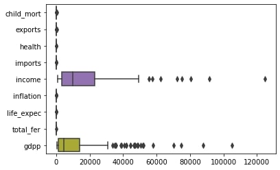

# Country Analysis

We will analyze a dataset that has some information about countries like GDP per capita, life expectation, income, etc.
After we understand the data, we will apply clustering.


```python
# Importing necessary libraries
import pandas as pd
import numpy as np
import seaborn as sns
import matplotlib.pyplot as plt
```

## Analysis and Preprocessing


```python
data = pd.read_csv("country-data.csv")
print(data.info())  # Taking a first look to our dataset.
```

    <class 'pandas.core.frame.DataFrame'>
    RangeIndex: 167 entries, 0 to 166
    Data columns (total 10 columns):
     #   Column      Non-Null Count  Dtype  
    ---  ------      --------------  -----  
     0   country     167 non-null    object 
     1   child_mort  167 non-null    float64
     2   exports     167 non-null    float64
     3   health      167 non-null    float64
     4   imports     167 non-null    float64
     5   income      167 non-null    int64  
     6   inflation   167 non-null    float64
     7   life_expec  167 non-null    float64
     8   total_fer   167 non-null    float64
     9   gdpp        167 non-null    int64  
    dtypes: float64(7), int64(2), object(1)
    memory usage: 13.2+ KB
    None


We see there are only one column which is not numeric.
That column represents country, which does not represent any real data,
so we can just drop it during process instead of vectorizing it.


```python
X = data.drop(["country"], axis=1)
y = data["country"]
```

At this point, lets start our analysis.


```python
# Calculating skewness for each column
print(X.skew(axis=0))
```

    child_mort    1.450774
    exports       2.445824
    health        0.705746
    imports       1.905276
    income        2.231480
    inflation     5.154049
    life_expec   -0.970996
    total_fer     0.967092
    gdpp          2.218051
    dtype: float64


First thing to notice is inflation column.
We can infer that a very big part of the countries has lower inflation rates.
Other three columns to notice are exports, income, and gdpp

We can also see the skewness of inflation column by using a histogram.


```python
sns.histplot(data=X, x='inflation')
plt.show()
```


    

    


We can easily see that the graph is right skewed.
Let's also see the kurtosis of our data.


```python
# Calculating kurtosis for each column
print(X.kurt(axis=0))
```

    child_mort     1.766882
    exports       10.138666
    health         0.694196
    imports        6.755854
    income         7.028657
    inflation     41.742502
    life_expec     1.151591
    total_fer     -0.186779
    gdpp           5.527891
    dtype: float64


We can easily observe that inflation and exports are far away from being normally distributed.
We can infer that there is a big difference between high and low inflation rates among countries as we saw on the previous graph.
Same can be said for exports.


There are no missing values in our dataset. But I will write a function to handle missing values anyways.


```python
from sklearn.impute import SimpleImputer

def handle_na(X: pd.DataFrame):  # Handling missing values

    nan_cols = []
    X.apply(lambda col: nan_cols.append(col.name) if col.isna().sum() > col.count() else col)
    X.drop(nan_cols, axis=1, inplace=True)  # Getting rid of columns if they are unusably sparse

    imputer = SimpleImputer(strategy='mean')
    # Imputing mean of column for null values
    imputed_X = pd.DataFrame(imputer.fit_transform(X), columns=X.columns)

    return imputed_X


X = handle_na(X)  # Now that we got rid of null values, let's take another look at our dataset.
```


```python
sns.histplot(data=X, x='exports')
plt.show()  # Another right skewed column
```


    

    


```python
sns.jointplot(data=X, x='income', y='life_expec', kind='kde', fill=True)
plt.show()  # Very useful graph. Clearly seeing the correlation.
```


    

    


```python
sns.boxplot(data=X, orient='h')
plt.show()  # We can clearly see that we have some outliers to handle
```


    

    


Above graph also shows that we should apply normalization to our dataset. But first, let's handle the outliers.


```python
def handle_outliers(X: pd.DataFrame):  # Handling outliers using IQR method

    q1 = X.quantile(0.25, numeric_only=True)
    q3 = X.quantile(0.75, numeric_only=True)
    iqr = q3 - q1
    lower_bound = q1 - 1.5 * iqr
    upper_bound = q3 + 1.5 * iqr

    # Capping values to upper/lower bounds
    capped_X = X.apply(
        lambda col: [(lower_bound[col.name] if i < lower_bound[col.name] else i) for i in col])
    capped_X = capped_X.apply(
        lambda col: [(upper_bound[col.name] if i > upper_bound[col.name] else i) for i in col])

    return capped_X


X = handle_outliers(X)
```

I didn't want to lose the outlying data so I applied a capping method instead of simply removing outliers. Now let's see how is our dataset's distribution with the help of a heatmap.


```python
# Plotting the correlation matrix with the help of heatmap.
corr_matrix = X.corr()
sns.heatmap(corr_matrix, cmap="YlGnBu")
plt.show()  # It seems that distribution is as it should be.
```


    

    


We can see there is some high correlation between some columns but it only makes sense for them to correlate. So I am assuming everything is okay here. Let's step into the scaling part.


```python
from sklearn.preprocessing import StandardScaler

# From previous boxplot we have seen we should scale our data.
def scale(X: pd.DataFrame):
    scaler = StandardScaler()
    scaled_X = pd.DataFrame(scaler.fit_transform(X), columns=X.columns)  # Transforming to Dataframe before returning
    return scaled_X


X = scale(X)
```

We have finished most of the preprocessing part so let's take another look to our dataset.


```python
pd.concat([y, X], axis=1).head()
```


<div>
<table border="1" class="dataframe">
  <thead>
    <tr style="text-align: right;">
      <th></th>
      <th>country</th>
      <th>child_mort</th>
      <th>exports</th>
      <th>health</th>
      <th>imports</th>
      <th>income</th>
      <th>inflation</th>
      <th>life_expec</th>
      <th>total_fer</th>
      <th>gdpp</th>
    </tr>
  </thead>
  <tbody>
    <tr>
      <th>0</th>
      <td>Afghanistan</td>
      <td>1.369802</td>
      <td>-1.391107</td>
      <td>0.296013</td>
      <td>-0.047444</td>
      <td>-0.943936</td>
      <td>0.355270</td>
      <td>-1.702225</td>
      <td>1.915276</td>
      <td>-0.846341</td>
    </tr>
    <tr>
      <th>1</th>
      <td>Albania</td>
      <td>-0.550464</td>
      <td>-0.543547</td>
      <td>-0.091190</td>
      <td>0.135021</td>
      <td>-0.395181</td>
      <td>-0.385208</td>
      <td>0.663321</td>
      <td>-0.862779</td>
      <td>-0.540827</td>
    </tr>
    <tr>
      <th>2</th>
      <td>Algeria</td>
      <td>-0.271295</td>
      <td>-0.053846</td>
      <td>-0.985893</td>
      <td>-0.713196</td>
      <td>-0.199291</td>
      <td>1.351551</td>
      <td>0.686859</td>
      <td>-0.036691</td>
      <td>-0.508868</td>
    </tr>
    <tr>
      <th>3</th>
      <td>Angola</td>
      <td>2.121210</td>
      <td>1.071524</td>
      <td>-1.482114</td>
      <td>-0.146074</td>
      <td>-0.660984</td>
      <td>2.293979</td>
      <td>-1.243238</td>
      <td>2.141784</td>
      <td>-0.589198</td>
    </tr>
    <tr>
      <th>4</th>
      <td>Antigua and Barbuda</td>
      <td>-0.714835</td>
      <td>0.280469</td>
      <td>-0.286671</td>
      <td>0.642965</td>
      <td>0.209637</td>
      <td>-0.841463</td>
      <td>0.722166</td>
      <td>-0.543003</td>
      <td>0.159686</td>
    </tr>
  </tbody>
</table>
</div>


Seems like nicely scaled and ready to roll.

## Building the Model

We have a range of clustering algorithms that we can use. We will try some of them choose which one works best for our data. First, let's determine the number of clusters for these algorithms using the elbow method.


```python
# Importing our algorithms first
from sklearn.cluster import KMeans
from sklearn.cluster import AgglomerativeClustering
from sklearn.cluster import DBSCAN
from scipy.spatial.distance import cdist

def number_of_clusters(X: pd.DataFrame):  # Figuring out how many clusters we need using elbow method
    distortions = []
    inertias = []
    mapping1 = {}
    mapping2 = {}

    for i in range(1, 10):
        model = KMeans(n_clusters=i).fit(X)

        distortions.append(sum(np.min(cdist(X, model.cluster_centers_, 'euclidean'), axis=1)) / X.shape[0])
        inertias.append(model.inertia_)

        mapping1[i] = sum(np.min(cdist(X, model.cluster_centers_, 'euclidean'), axis=1)) / X.shape[0]
        mapping2[i] = model.inertia_

    sns.lineplot(x=range(1, 10), y=distortions)  # Using a graph to clearly see
    plt.xlabel("n_clusters")
    plt.ylabel("Distortion")
    plt.title("Elbow Method Using Distortion")
    plt.show()  # Seems like 5 clusters is optimal for this data.


number_of_clusters(X)  # Deciding on cluster number

```


    

    


Seems like 5 clusters will most likely do the job for us. After deciding the cluster number, time to apply clustering algorithms and see which performs better on our dataset.


```python
def apply_kmeans(X: pd.DataFrame):
    kmeans = KMeans(n_clusters=5)
    y_kmeans = kmeans.fit_predict(X)
    cluster_id = pd.Series(y_kmeans, name="cluster_id")

    # Concatenating with country column to take a better look
    data_kmeans = pd.concat([data["country"], X, cluster_id], axis=1)
    return data_kmeans

data_kmeans = apply_kmeans(X)
```


```python
def apply_hierarchical(X: pd.DataFrame):
    hierarchical_cluster = AgglomerativeClustering(n_clusters=5, affinity='euclidean', linkage='ward')
    y_hierarchical = hierarchical_cluster.fit_predict(X)
    cluster_id = pd.Series(y_hierarchical, name="cluster_id")

    # Concatenating with country column to take a better look
    data_hierarchical = pd.concat([data["country"], X, cluster_id], axis=1)
    return data_hierarchical

data_hierarchical = apply_hierarchical(X)
```

Third algorithm that we will apply is DBSCAN. Since this one works much different from KMeans and Agglomerative, we will use some methods to determine best parameters for DBSCAN. Below one is to determine the best eps value.


```python
from sklearn.neighbors import NearestNeighbors

def eps_elbow_dbscan(X: pd.DataFrame):
    neighbors = NearestNeighbors(n_neighbors=20)
    neighbors_fit = neighbors.fit(X)
    distances, indices = neighbors_fit.kneighbors(X)
    distances = np.sort(distances, axis=0)
    distances = distances[:, 1]
    sns.lineplot(data=distances)
    plt.title("Elbow Method to determine eps parameter")
    plt.show()
    
eps_elbow_dbscan(X)
```


    

    


After examining the graph, we see that the optimum value for eps is around 1.5. I will set the min_samples parameter to 2 since we have only 167 countries hence this dataset is very small.


```python
def apply_dbscan(X: pd.DataFrame):
    dbscan = DBSCAN(eps=1.5, min_samples=2)
    y_dbscan = dbscan.fit_predict(X)
    cluster_id = pd.Series(y_dbscan, name="cluster_id")

    # Concatenating with country column to take a better look
    data_dbscan = pd.concat([data["country"], X, cluster_id], axis=1)
    return data_dbscan

# Applying dbscan with optimum parameters
data_dbscan = apply_dbscan(X)
```

Now we need to decide which algorithm performs best for our dataset. A method to compare them is to
plot the data in 2D space to see clusters clearly.


```python
# Reducing dimensions to 2
def apply_pca_2d(X: pd.DataFrame):
    from sklearn.decomposition import PCA

    pca = PCA(n_components=2)
    principalComponents = pca.fit_transform(X.drop(["cluster_id", "country"], axis=1))
    principalDf = pd.DataFrame(data=principalComponents,
                               columns=['PC1', 'PC2'])
    principalDf = pd.concat([X["country"], principalDf, X["cluster_id"]], axis=1)
    return principalDf


# Applying pca to every dataset
pca_kmeans = apply_pca_2d(data_kmeans)
pca_hierarchical = apply_pca_2d(data_hierarchical)
pca_dbscan = apply_pca_2d(data_dbscan)

# Plotting every algorithm side by side to easy comparison
fig, axes = plt.subplots(1, 3, figsize=(15, 5))
sns.scatterplot(data=pca_kmeans, x="PC1", y="PC2", hue="cluster_id", palette="deep", ax=axes[0])
sns.scatterplot(data=pca_hierarchical, x="PC1", y="PC2", hue="cluster_id", palette="deep", ax=axes[1])
sns.scatterplot(data=pca_dbscan, x="PC1", y="PC2", hue="cluster_id", palette="deep", ax=axes[2])
fig.suptitle("Clustering Algorithms Comparison")
axes[0].set_title("KMeans")
axes[1].set_title("Hierarchical")
axes[2].set_title("DBSCAN")
plt.show()
```


    

    


Both KMeans and Hierarchical look really strong but I believe KMeans did a slightly better job here so I will continue with it.


```python
# After examining the graphs, I decided that the KMeans clustering did the best for our data.
X_kmeans = data_kmeans.drop(["country"], axis=1)
```

Now that we have our clusters, we will apply some statistical methods to observe if our clusters are actually different and meaningful in terms of statistics.


```python
# We will use ANOVA Test to see if our clusters actually different and meaningful in terms of statistics.
def anova(X: pd.DataFrame):
    from scipy.stats import f_oneway

    clusters = X.groupby("cluster_id")
    cluster0 = clusters.get_group(0).drop(["cluster_id"], axis=1)
    cluster1 = clusters.get_group(1).drop(["cluster_id"], axis=1)
    cluster2 = clusters.get_group(2).drop(["cluster_id"], axis=1)
    cluster3 = clusters.get_group(3).drop(["cluster_id"], axis=1)
    cluster4 = clusters.get_group(4).drop(["cluster_id"], axis=1)
    return f_oneway(cluster0, cluster1, cluster2, cluster3, cluster4)

f, p = anova(X_kmeans)
print(f"{f}\n{p}")
```

    [171.1041513   38.9493999   17.97540647  28.40284433 155.81158477
      19.27423855 110.32425981 112.84333705 245.48939116]
    [4.56247020e-57 8.05773649e-23 3.10681170e-12 6.96744227e-18
     1.95019832e-54 5.48888661e-13 3.37010212e-45 8.86177530e-46
     1.22428533e-67]


Since our p-values are lower than 0.05, that means there is a significant difference between our clusters  statistically. This result means we did a great job on these clusters. Now let's use a similar statistical method to see this column by column.


```python
def tukey(X: pd.DataFrame, col: str):
    from statsmodels.stats.multicomp import pairwise_tukeyhsd

    return pairwise_tukeyhsd(endog=X[col], groups=X["cluster_id"], alpha=0.05)


tukey_res = tukey(X_kmeans, col="inflation")
print(tukey_res)
```

    Multiple Comparison of Means - Tukey HSD, FWER=0.05 
    ====================================================
    group1 group2 meandiff p-adj   lower   upper  reject
    ----------------------------------------------------
         0      1  -1.2851    0.0 -1.8944 -0.6758   True
         0      2  -0.6962 0.0163 -1.3056 -0.0869   True
         0      3  -0.8666    0.0 -1.3569 -0.3763   True
         0      4   0.3274 0.4437 -0.2074  0.8622  False
         1      2   0.5889 0.1387 -0.1063   1.284  False
         1      3   0.4185  0.298 -0.1751  1.0121  False
         1      4   1.6125    0.0  0.9816  2.2433   True
         2      3  -0.1703 0.9327 -0.7639  0.4233  False
         2      4   1.0236 0.0001  0.3928  1.6545   True
         3      4    1.194    0.0  0.6772  1.7108   True
    ----------------------------------------------------


We can observe how the clusters differs from each other column by column.
For example, cluster2 significantly differ from cluster4 in terms of 'inflation'.
But it does not significantly differ from cluster3 in terms of 'inflation'.
After playing around and testing all columns, we conclude that our clusters are meaningful in terms of statistics.

Keep in mind these numbers are 4-digit accurate. So zeros here are not actually zero but very small numbers.

Now that we are sure that our clusters are actually good, we can plot them and conclude this project here.


```python
# Finally, we plot our cluster.
fig, ax = plt.subplots(figsize=(7,5))
sns.scatterplot(data=pca_kmeans, x="PC1", y="PC2", hue="cluster_id", palette="deep",ax=ax)
plt.title("Final Cluster")
plt.show()
```


    

    


### Thanks for reading.
